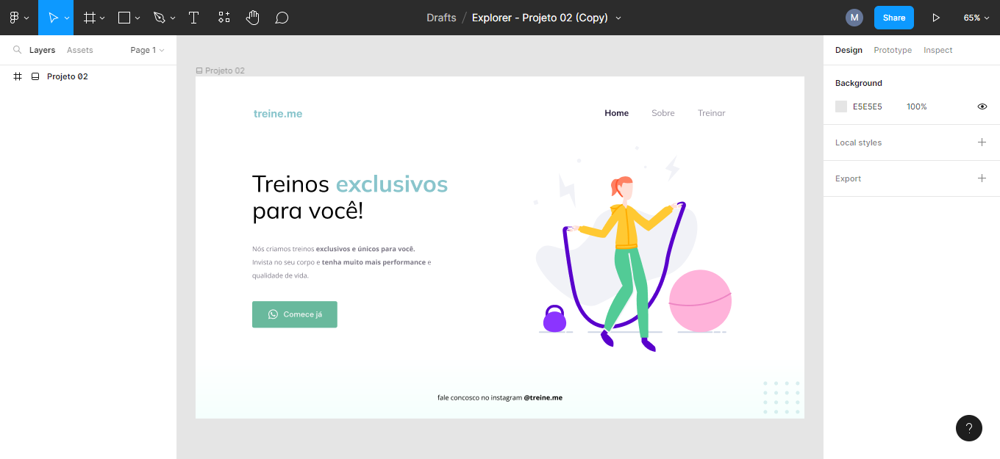

## 🚀 Rockeatseat 
<h1>Stage 02 - Introdução ao HTML e CSS</h1>

<h3>Aula 02 - Conhecendo novos conceitos de HTML e CSS</h3>

  

<h4>Descrição</h4>

Apresentação do projeto 02 trabalhando com textos, posicionamentos, espaçamentos e introdução a novas propriedades. 

Link do Projeto

Arquivo do Projeto no Figma: <a href="https://www.figma.com/file/HxtcwYRpPZy2ZS5otZDAeW/Explorer---Projeto-02-(Copy)?node-id=0-1&t=3WlgqHCyoPVRqzro-0">Explorer / Stage 02 Projeto 02</a>
